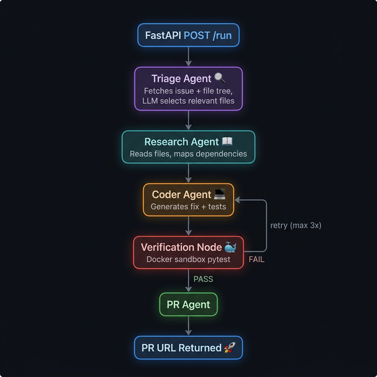

<div align="center">

#  Autonomous PR Engine

### *From GitHub Issue to Pull Request — Zero Human Intervention*

An AI-powered multi-agent system that reads a GitHub issue, understands the codebase,
generates a verified fix, and opens a Pull Request — fully autonomously.

[](https://python.org)
[](https://langchain-ai.github.io/langgraph/)
[](https://anthropic.com)
[](https://fastapi.tiangolo.com)
[](https://docker.com)

---

</div>

##  Architecture

<div align="center">
  
</div>

---

## 💡 Why This Project?

Modern software teams drown in issues — bug reports pile up, context-switching kills velocity, and simple fixes sit untouched for weeks. What if an AI system could:

- **Read** a GitHub issue and understand the intent
- **Navigate** a codebase to find the relevant files
- **Analyze** dependencies and trace the root cause
- **Write** a production-quality fix with tests
- **Verify** the fix in an isolated sandbox
- **Submit** a Pull Request — ready for human review

That's exactly what this engine does. It's not a copilot that waits for instructions — it's a **fully autonomous agent** that takes a single URL and delivers a PR.

### Why LangGraph?

Traditional LLM chains are linear. Real-world coding is iterative. LangGraph provides:

| Feature | Why It Matters |
|---|---|
| **Conditional Edges** | Retry loop — if tests fail, the Coder Agent reflects and tries again |
| **Shared State** | All agents read/write to a single `AgentState`, keeping context aligned |
| **Node-based DAG** | Each agent is a pure function — easy to test, swap, or extend |
| **Built-in Persistence** | State checkpointing comes free with the framework |

---

## 🏗️ How It Works

The engine follows a **Plan → Execute → Verify → Submit** pipeline:

```
User sends issue URL
         │
         ▼
   ┌───────────┐
   │  TRIAGE   │  → Fetches issue details + full repo file tree
   │  AGENT    │  → LLM selects 3–10 most relevant files
   └─────┬─────┘
         ▼
   ┌───────────┐
   │ RESEARCH  │  → Reads content of each relevant file
   │  AGENT    │  → LLM maps dependencies + identifies root cause
   └─────┬─────┘
         ▼
   ┌───────────┐ ◄─────────────────────────────────────┐
   │  CODER    │  → Generates fix plan + code changes   │
   │  AGENT    │  → Writes pytest test file              │ RETRY LOOP
   └─────┬─────┘  → On retry: reflects on error logs    │ (max 3×)
         ▼                                              │
   ┌───────────┐                                        │
   │  VERIFY   │  → Clones repo into temp directory     │
   │   NODE    │  → Applies fix + runs pytest in Docker  │
   └─────┬─────┘  → No internet, memory-capped, sandboxed│
         │                                              │
    ┌────┴────┐                                         │
  PASS?     FAIL? ──────────────────────────────────────┘
    │
    ▼
   ┌───────────┐
   │ PR AGENT  │  → Creates branch (fix/issue-N-slug)
   │           │  → Commits changes + test file
   └─────┬─────┘  → LLM writes PR description
         │        → Opens Pull Request on GitHub
         ▼
   PR URL returned ✅
```

### The Retry / Reflection Loop

When tests fail, the Coder Agent doesn't just retry blindly. It receives the **error logs** from the Docker sandbox and a reflection prompt:

> *"YOUR PREVIOUS ATTEMPT FAILED. Error logs: `[...pytest output...]`. This is retry #2. Reflect on the errors and produce a corrected fix."*

This self-correction mechanism dramatically improves fix quality — the agent learns from its own mistakes within a single run.

---

## 🔧 Tech Stack

| Layer | Technology | Purpose |
|---|---|---|
| **Orchestration** | LangGraph | Multi-agent StateGraph with conditional routing |
| **LLM** | Anthropic Claude | Code understanding, fix generation, PR writing |
| **Structured Output** | Pydantic v2 | Type-safe LLM responses via `with_structured_output()` |
| **GitHub API** | PyGithub | Issue fetching, file reading, branch/commit/PR creation |
| **Web Framework** | FastAPI + Uvicorn | Async API server with auto-generated OpenAPI docs |
| **Sandbox** | Docker | Isolated test execution (no network, unprivileged) |
| **Logging** | structlog | Structured JSON logging across all agents |
| **Config** | pydantic-settings | Type-safe env var management from `.env` |

---

##  Agent Deep Dive

### Agent 01 — Triage Agent

**Job:** Figure out *which files matter*.

The Triage Agent fetches the issue (title, body, labels) and the full repository file tree via the GitHub API. It then sends both to Claude with a prompt that guides file selection:

- Files that likely **contain** the bug
- Files that **test** the buggy code  
- Files that **depend on** the broken module
- Excludes: docs, lock files, CI configs, binaries

**Output:** `relevant_files` — a curated list of 3–10 file paths.

---

### Agent 02 — Research Agent

**Job:** Understand *how the code works*.

Reads the content of every file selected by the Triage Agent. Sends all file contents to Claude for deep analysis:

- **Bug Location** — pinpoints the exact file, function, and line
- **Root Cause** — explains *why* the bug happens (logic error, missing check, etc.)
- **Dependency Map** — what each file exports, imports, and depends on
- **Suggested Approach** — high-level fix strategy

**Output:** `file_contents` + `dependency_map` (structured JSON)

---

### Agent 03 — Coder Agent

**Job:** Write *the actual fix*.

This is the workhorse of the pipeline. It receives the issue, all file contents, and the Research Agent's analysis, then generates:

1. A **step-by-step fix plan**
2. **Modified file contents** (complete files, not diffs)
3. A **pytest test file** that verifies the fix

On retry, it additionally receives the error logs and a reflection prompt, producing a corrected fix.

**Output:** `plan`, `patch` (JSON of file changes), `test_code`

---

### Verification Node (Non-LLM)

**Job:** Prove *the fix actually works*.

This is pure Python — no AI involved. It:

1. Clones the repo into a temp directory (`git clone --depth=1`)
2. Overwrites files with the Coder Agent's fixes
3. Writes the test file
4. Runs pytest inside a **Docker sandbox**:
   ```
   docker run --rm --network=none --memory=512m --cpus=1.0 \
     --user=nobody -v {workspace}:/app \
     pr-engine-sandbox:latest pytest tests/test_fix_issue_N.py
   ```
5. Captures exit code + output
6. Cleans up the temp directory

**Security:** No internet, memory-capped, CPU-limited, unprivileged user, read-only mount.

---

### Agent 04 — PR Agent

**Job:** Ship it.

Once tests pass, the PR Agent:

1. Creates a feature branch: `fix/issue-42-handle-null-password-in-login`
2. Commits all changed files + the test file
3. Asks Claude to write a professional PR description (with `Fixes #42`)
4. Opens the Pull Request on GitHub

**Output:** `branch_name`, `pr_url`

---

## 📁 Project Structure

```
pr-engine/
├── api.py                    # FastAPI server (POST /run, GET /health)
├── graph.py                  # LangGraph StateGraph + conditional routing
├── state.py                  # AgentState TypedDict (shared across all nodes)
├── config.py                 # Centralized settings from .env
├── logger.py                 # structlog configuration
├── requirements.txt
├── .env.example
│
├── agents/
│   ├── triage.py             # Agent 01 — File relevance selection
│   ├── research.py           # Agent 02 — Dependency analysis
│   ├── coder.py              # Agent 03 — Code fix generation + retry
│   └── pr_agent.py           # Agent 04 — Branch, commit, open PR
│
├── nodes/
│   └── verification.py       # Docker sandbox test runner (non-LLM)
│
├── tools/
│   └── github_tools.py       # 6 PyGithub @tool functions
│
├── docker/
│   └── Dockerfile.sandbox    # Python 3.11 + pytest sandbox image
│
└── assets/
    └── architecture.png      # Architecture diagram
```

---

##  Getting Started

### Prerequisites

- **Python 3.9+**
- **Docker** (for running tests in sandbox)
- **Anthropic API Key** — [console.anthropic.com](https://console.anthropic.com)
- **GitHub Token** — [github.com/settings/tokens](https://github.com/settings/tokens)
  - Scopes needed: `Contents (R/W)`, `Issues (R)`, `Pull Requests (R/W)`, `Metadata (R)`

### 1. Clone & Install

```bash
git clone https://github.com/yourusername/pr-engine.git
cd pr-engine

python -m venv venv
source venv/bin/activate   # Windows: venv\Scripts\activate
pip install -r requirements.txt
```

### 2. Configure Environment

```bash
cp .env.example .env
```

Edit `.env` with your keys:

```env
ANTHROPIC_API_KEY=sk-ant-...
GITHUB_TOKEN=ghp_...
MODEL_NAME=claude-sonnet-4-20250514    # or claude-opus-4-5 for best quality
```

### 3. Build the Sandbox Image

```bash
docker build -f docker/Dockerfile.sandbox -t pr-engine-sandbox:latest .
```

### 4. Start the Server

```bash
uvicorn api:app --reload --port 8000
```

### 5. Send an Issue

```bash
curl -X POST http://localhost:8000/run \
  -H "Content-Type: application/json" \
  -d '{"issue_url": "https://github.com/owner/repo/issues/42"}'
```

---

##  API Reference

### `GET /health`

Returns service status and configuration.

```json
{
  "status": "ok",
  "timestamp": "2026-03-15T18:00:00Z",
  "model": "claude-sonnet-4-20250514",
  "max_retries": 3,
  "log_level": "INFO",
  "version": "1.0.0"
}
```

### `POST /run`

Runs the full autonomous pipeline.

**Request:**
```json
{
  "issue_url": "https://github.com/owner/repo/issues/42"
}
```

**Success Response:**
```json
{
  "status": "success",
  "pr_url": "https://github.com/owner/repo/pull/99",
  "issue_url": "https://github.com/owner/repo/issues/42",
  "retry_count": 1,
  "duration_seconds": 47.3
}
```

**Failure Response:**
```json
{
  "status": "failed",
  "pr_url": null,
  "issue_url": "https://github.com/owner/repo/issues/42",
  "error": "Max retries exceeded (3). Tests did not pass after 3 attempt(s).",
  "retry_count": 3,
  "duration_seconds": 180.1
}
```

Interactive docs available at: `http://localhost:8000/docs`

---

## 🔒 Security

The sandbox is designed to run untrusted code safely:

| Measure | Purpose |
|---|---|
| `--network=none` | No outbound internet access |
| `--memory=512m` | Prevents memory bombs |
| `--cpus=1.0` | Prevents CPU exhaustion |
| `--user=nobody` | Runs as unprivileged user |
| `120s timeout` | Kills runaway containers |
| Temp directory cleanup | No artifacts left on host |

---

## ⚙️ Configuration

All settings are managed via `.env`:

| Variable | Default | Description |
|---|---|---|
| `ANTHROPIC_API_KEY` | *required* | Anthropic API key |
| `GITHUB_TOKEN` | *required* | GitHub PAT with repo permissions |
| `MODEL_NAME` | `claude-opus-4-5` | LLM model (`claude-opus-4-5` or `claude-sonnet-4-20250514`) |
| `MAX_RETRY_COUNT` | `3` | Max Coder Agent retries on test failure |
| `SANDBOX_IMAGE_NAME` | `pr-engine-sandbox:latest` | Docker image for test runner |
| `LOG_LEVEL` | `INFO` | Logging verbosity |
| `PORT` | `8000` | Server port |

---

##  Design Decisions

### Why Agents, Not a Single Prompt?

A single massive prompt would be unreliable and expensive. Breaking the task into specialized agents provides:

- **Focus** — each agent has one clear job and a tailored system prompt
- **Debuggability** — structured logging shows exactly what each agent decided
- **Retryability** — only the Coder Agent retries, not the entire pipeline
- **Extensibility** — add new agents (e.g., a Security Reviewer) without touching existing ones

### Why Docker for Verification?

LLM-generated code is unpredictable. Running it on the host would be dangerous. Docker provides:

- **Isolation** — buggy code can't affect the host system
- **Reproducibility** — same environment every time
- **Security** — no network, no privileges, resource limits

### Why Structured Output (Pydantic)?

Free-form LLM text is fragile to parse. `with_structured_output()` forces the LLM to return typed JSON matching a Pydantic model — no regex parsing, no "I couldn't find the JSON" failures.

### Why TypedDict Over Pydantic for State?

LangGraph's `StateGraph` expects `TypedDict` for state schemas. It enables native field-level merging (agents return only updated fields, LangGraph merges them) and avoids Pydantic validation overhead on every state transition.

---

##  Roadmap

- [ ] **Streaming** — Real-time progress updates via WebSocket / SSE
- [ ] **Multi-repo support** — Handle monorepo sub-packages
- [ ] **Custom sandbox** — Auto-install repo-specific dependencies
- [ ] **Security Agent** — Review generated code for vulnerabilities
- [ ] **GitHub App** — Trigger on issue label (e.g., `auto-fix`)
- [ ] **Dashboard** — Web UI to monitor pipeline runs

---

## 📄 License

MIT

---

<div align="center">

**Built with**  **Python** · **LangGraph** ·  **Claude** ·  **Docker**


</div>
